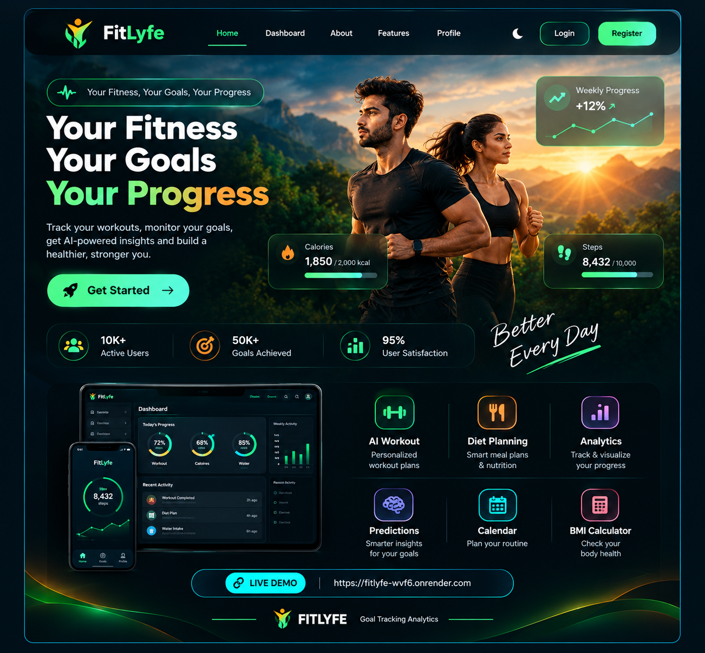

<!-- ═══════════════════════════════════════════════════════════════ -->
<!--                         HERO HEADER                           -->
<!-- ═══════════════════════════════════════════════════════════════ -->

 

  

  

---

<!-- ═══════════════════════════════════════════════════════════════ -->
<!--                         INTRODUCTION                          -->
<!-- ═══════════════════════════════════════════════════════════════ -->

# 👋 HELLO, I'M NAVEEN KUMAR

  

<table>
<tr>

<td width="55%" align="center">

<h2>🎓 EDUCATION</h2>

 

<h3>🎓 M.Sc. Applied Data Science</h3>

<b>Advanced Data Analysis</b> 
Python • SQL • Visualization • Machine Learning

 

<h3>💻 BCA Graduate</h3>

<b>Computer Applications</b> 
Programming • Databases • Web Technologies

</td>

<td width="45%" align="center">

  

</td>

</tr>
</table>

 

---

# 🧠 ABOUT ME

<table>

<tr>

<td align="center" width="50%">

<h3>🎓 EDUCATION</h3>

M.Sc. Applied Data Science 
BCA Graduate

</td>

<td align="center" width="50%">

<h3>📊 DATA</h3>

Data Analytics 
Data Visualization 
Data-Driven Insights

</td>

</tr>

<tr>

<td align="center">

<h3>🐍 PROGRAMMING</h3>

Python 
SQL 
JavaScript

</td>

<td align="center">

<h3>📈 ANALYTICS</h3>

Power BI 
Pandas 
NumPy 
Matplotlib • Plotly

</td>

</tr>

</table>

 

---

# ⚡ TECH STACK

## 🐍 Programming & Development

 

---

## 📊 Data Analytics

 

---

## 🗄️ Databases & Tools

  

---

# 🚀 FEATURED PROJECT

  

<table>

<tr>

<td width="45%" align="center">

  

  

</td>

<td width="55%">

<h2>🏋️ FitLyfe — Goal Tracking Analytics</h2>

A fitness and daily-routine analytics application designed to help users track activities, monitor goals and understand their progress through data.

<h3>✨ FEATURES</h3>

<table>

<tr>
<td>👤</td>
<td><b>User Profile</b></td>
</tr>

<tr>
<td>🎯</td>
<td><b>Goal Tracking</b></td>
</tr>

<tr>
<td>📝</td>
<td><b>Daily Activity Logs</b></td>
</tr>

<tr>
<td>📊</td>
<td><b>Analytics Dashboard</b></td>
</tr>

<tr>
<td>📈</td>
<td><b>Progress Analysis</b></td>
</tr>

<tr>
<td>🤖</td>
<td><b>Predictions</b></td>
</tr>

<tr>
<td>💪</td>
<td><b>AI Workout</b></td>
</tr>

<tr>
<td>🍱</td>
<td><b>Diet Planning</b></td>
</tr>

<tr>
<td>📅</td>
<td><b>Calendar Tracking</b></td>
</tr>

<tr>
<td>⚖️</td>
<td><b>BMI Calculator</b></td>
</tr>

</table>

</td>

</tr>

</table>

 

<h3>🔧 TECHNOLOGIES</h3>

  

---

# 📊 DATA ANALYTICS WORKFLOW

  

<pre>
┌──────────────────────────────────────┐
│              📥 RAW DATA             │
└──────────────────┬───────────────────┘
                   │
                   ▼
┌──────────────────────────────────────┐
│           🧹 DATA CLEANING           │
└──────────────────┬───────────────────┘
                   │
                   ▼
┌──────────────────────────────────────┐
│          🐍 SQL / PYTHON             │
└──────────────────┬───────────────────┘
                   │
                   ▼
┌──────────────────────────────────────┐
│             🔍 ANALYSIS              │
└──────────────────┬───────────────────┘
                   │
                   ▼
┌──────────────────────────────────────┐
│          📊 VISUALIZATION            │
└──────────────────┬───────────────────┘
                   │
                   ▼
┌──────────────────────────────────────┐
│             💡 INSIGHTS              │
└──────────────────┬───────────────────┘
                   │
                   ▼
┌──────────────────────────────────────┐
│            🎯 DECISIONS              │
└──────────────────────────────────────┘
</pre>

---

# 📈 GITHUB ANALYTICS

  

---

# 📊 CONTRIBUTION ACTIVITY

  

---

# 🐍 CONTRIBUTION SNAKE

 

---

# 🎓 CERTIFICATIONS & LEARNING

<table>

<tr>

<td align="center" width="50%">

<h2>🐍</h2>
<h3>Python</h3>
<b>Naan Mudhalvan</b>

</td>

<td align="center" width="50%">

<h2>🗄️</h2>
<h3>SQL</h3>
<b>Naan Mudhalvan</b>

</td>

</tr>

<tr>

<td align="center">

<h2>🍃</h2>
<h3>MongoDB</h3>
<b>Naan Mudhalvan</b>

</td>

<td align="center">

<h2>☁️</h2>
<h3>Cloud Computing</h3>
<b>Naan Mudhalvan</b>

</td>

</tr>

<tr>

<td align="center">

<h2>💬</h2>
<h3>Communication Skills</h3>
<b>Naan Mudhalvan</b>

</td>

<td align="center">

<h2>🤖</h2>
<h3>AI/ML for Developers</h3>
<b>Google</b>

</td>

</tr>

<tr>

<td align="center">

<h2>☁️</h2>
<h3>Cloud Architecture</h3>
<b>Oracle</b>

</td>

<td align="center">

<h2>☁️</h2>
<h3>Cloud Foundations</h3>
<b>Oracle</b>

</td>

</tr>

<tr>

<td align="center">

<h2>🍃</h2>
<h3>MongoDB Database Administration</h3>
<b>SmartBridge</b>

</td>

<td align="center">

<h2>🐍</h2>
<h3>Python</h3>
<b>Kaggle</b>

</td>

</tr>

</table>

---

# 📚 LEARNING JOURNEY

  

<table>

<tr>
<th>📚 AREA</th>
<th>🎯 CURRENT FOCUS</th>
</tr>

<tr>
<td>🐍 <b>Python</b></td>
<td>Programming → Advanced Concepts → Data Analysis</td>
</tr>

<tr>
<td>🗄️ <b>SQL</b></td>
<td>Queries → Joins → Aggregations → Data Analysis</td>
</tr>

<tr>
<td>📊 <b>Power BI</b></td>
<td>Dashboards → Data Modeling → Visualization</td>
</tr>

<tr>
<td>🧮 <b>Data Structures</b></td>
<td>Arrays → Strings → Searching → Sorting</td>
</tr>

<tr>
<td>📈 <b>Data Analytics</b></td>
<td>Cleaning → Analysis → Visualization → Insights</td>
</tr>

<tr>
<td>🤖 <b>Machine Learning</b></td>
<td>Fundamentals → Practical Applications</td>
</tr>

<tr>
<td>🧠 <b>Problem Solving</b></td>
<td>Logic → Algorithms → Interview Preparation</td>
</tr>

</table>

---

# 🎯 CAREER FOCUS

  

<table>

<tr>

<td align="center" width="25%">

<h2>🐍</h2>
<h3>Python</h3>
Programming 
Data Analysis

</td>

<td align="center" width="25%">

<h2>🗄️</h2>
<h3>SQL</h3>
Databases 
Data Analysis

</td>

<td align="center" width="25%">

<h2>📊</h2>
<h3>Power BI</h3>
Dashboards 
Visualization

</td>

<td align="center" width="25%">

<h2>🧠</h2>
<h3>Problem Solving</h3>
Logic 
Algorithms

</td>

</tr>

</table>

 

  

<h2>LEARN → BUILD → ANALYZE → IMPROVE</h2>

---

# 💡 WHAT I LIKE BUILDING

<table>

<tr>

<td align="center" width="33%">

<h2>📊</h2>
<h3>Data Analytics</h3>

Turning raw data into 
meaningful insights.

</td>

<td align="center" width="33%">

<h2>🐍</h2>
<h3>Python Projects</h3>

Building practical 
data-driven applications.

</td>

<td align="center" width="33%">

<h2>🗄️</h2>
<h3>SQL Solutions</h3>

Working with databases, 
queries and analysis.

</td>

</tr>

<tr>

<td align="center">

<h2>📈</h2>
<h3>Interactive Dashboards</h3>

Creating dashboards that 
make data easier to understand.

</td>

<td align="center">

<h2>🏋️</h2>
<h3>Fitness Analytics</h3>

Analyzing fitness, goals 
and daily-routine data.

</td>

<td align="center">

<h2>🤖</h2>
<h3>Data-Driven Applications</h3>

Combining programming, 
analytics and intelligent features.

</td>

</tr>

</table>

 

---

# 🌱 CURRENTLY LEARNING

  

<table>

<tr>

<td align="center" width="33%">

<h2>🐍</h2>
<h3>Python</h3>

Advanced Programming 
Data Analysis

</td>

<td align="center" width="33%">

<h2>🗄️</h2>
<h3>SQL</h3>

Queries 
Joins & Aggregations

</td>

<td align="center" width="33%">

<h2>📊</h2>
<h3>Power BI</h3>

Dashboards 
Data Visualization

</td>

</tr>

<tr>

<td align="center" width="33%">

<h2>🧠</h2>
<h3>Data Structures</h3>

Arrays • Strings 
Searching • Sorting

</td>

<td align="center" width="33%">

<h2>📈</h2>
<h3>Data Analytics</h3>

Cleaning → Analysis 
Visualization → Insights

</td>

<td align="center" width="33%">

<h2>🤖</h2>
<h3>Machine Learning</h3>

Fundamentals 
Practical Applications

</td>

</tr>

</table>

 

---

# 🏆 GITHUB PROFILE

---

# 🤝 LET'S CONNECT

  

  

  

  

<h3>📊 DATA • PYTHON • SQL • POWER BI • ANALYTICS</h3>

---

<h2>LEARN • BUILD • ANALYZE • IMPROVE</h2>

 

  

